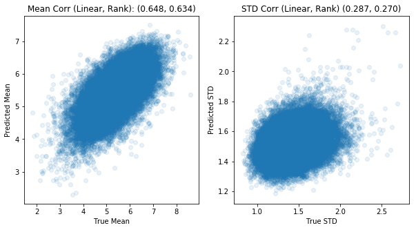

# Goal
Create a machine learning model to accurately rate the aesthetics of images

# About
This project is an implementation of the [Neural Image Assessment paper](https://arxiv.org/abs/1709.05424). While the paper uses models Inception-v2, MobileNet, and VGG16, this project uses DenseNet121. Not only does DenseNet in general have a higher accuracy rating on than any of the other models, but it also has fewer parameters. This makes not only training significantly faster, but using it  computationally more efficient.

| Model              | Accuracy      | LLC (mean)    | SRCC (mean)   | LLC (std)     | SRCC (std)    | EMD           |
| ------------------ | ------------- | ------------- | ------------- | ------------- | ------------- | ------------- | 
| NIMA(MobileNet)    | 80.36%        | 0.518         | 0.510         | 0.152         | 0.137         | 0.081         |
| NIMA(VGG16)        | 80.60%        | 0.610         | 0.592         | 0.205         | 0.202         | 0.051         |
| NIMA(Inception-v2) | 81.51%        | 0.638         | 0.612         | 0.233         | 0.218         | 0.050         |
| NIMA(DenseNet121)  | 81.28%        | 0.648         | 0.634         | 0.287         | 0.270         | 

### Acknowledgements
* [AVA Dataset: Aesthetic Visual Analysis](https://ieeexplore.ieee.org/document/6247954)
* [NIMA: Neural Image Assessment](https://arxiv.org/abs/1709.05424)
* [Visual aesthetic analysis using deep neural network: model and techniques to increase accuracy without transfer learning](https://arxiv.org/abs/1712.03382v1)
